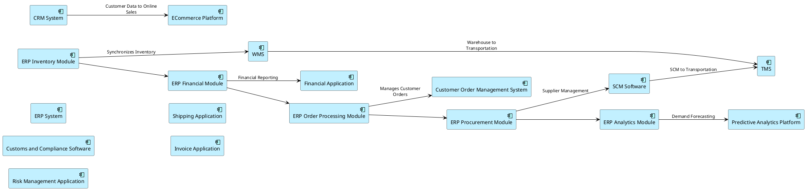
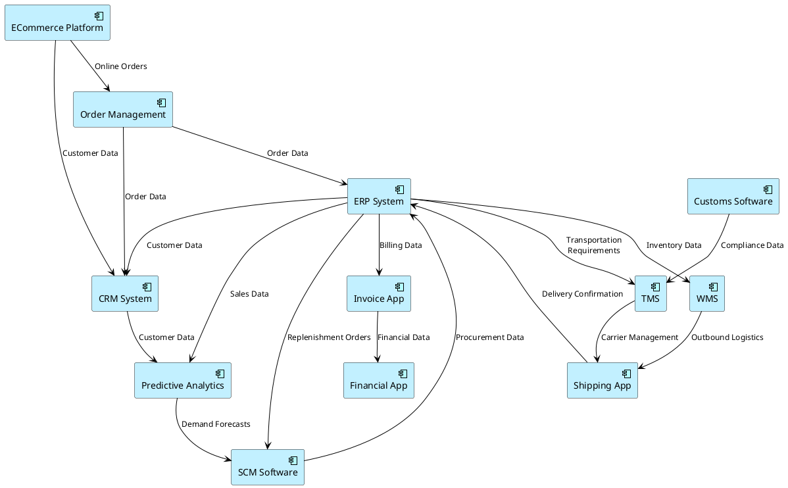
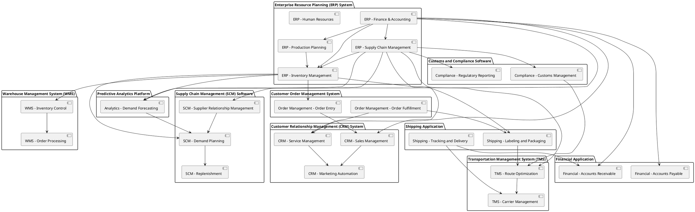

## Baseline architecture

```plantuml
@startuml

package "Enterprise Resource Planning (ERP) System" {
  [ERP - Finance & Accounting] as ERPFA
  [ERP - Supply Chain Management] as ERPSCM
  [ERP - Production Planning] as ERPPP
  [ERP - Human Resources] as ERPHR
  [ERP - Inventory Management] as ERPIM
}

package "Customer Relationship Management (CRM) System" {
  [CRM - Sales Management] as CRMSM
  [CRM - Marketing Automation] as CRMM
  [CRM - Service Support] as CRMS
  [CRM - Customer Analytics] as CRMA
}

package "Precision Agriculture Platform" {
  [Telemetry & Fleet Management] as TFM
  [Field Data Collection] as FDC
  [Yield Mapping & Analysis] as YMA
  [Precision Planting Solutions] as PPS
}

package "Dealer Management System (DMS)" {
  [DMS - Sales & Distribution] as DMSSD
  [DMS - Service & Repair Management] as DMSSRM
  [DMS - Parts Inventory & Ordering] as DMSPIO
  [DMS - Dealer Analytics] as DMSDA
}

package "Product Lifecycle Management (PLM) System" {
  [PLM - Design & Engineering] as PLMDE
  [PLM - Compliance Management] as PLMCM
  [PLM - Product Data Management] as PLMPDM
}

package "Supply Chain Management System" {
  [SCM - Vendor Management] as SCMVM
  [SCM - Logistics & Distribution] as SCMLOG
  [SCM - Demand Planning] as SCMDP
}

package "Business Intelligence (BI) System" {
  [BI - Data Warehousing] as BIDW
  [BI - Reporting & Analytics] as BIRA
  [BI - Dashboards & KPIs] as BIDK
}

[Manufacturing Execution System (MES)] as MES
[Retail & Wholesale Finance System] as RWFS
[Human Capital Management (HCM) System] as HCM
[Environmental Health & Safety (EHS) System] as EHS

ERPFA --> ERPPP
ERPFA --> ERPSCM
ERPFA --> ERPIM
ERPSCM --> ERPIM
ERPPP --> MES
ERPIM --> MES

CRMSM --> CRMM
CRMSM --> CRMS
CRMSM --> CRMA
CRMS --> ERPSCM
CRMA --> BIRA

TFM --> FDC
FDC --> YMA
PPS --> FDC
YMA --> BIRA

DMSSD --> DMSSRM
DMSSD --> DMSPIO
DMSSRM --> ERPSCM
DMSPIO --> ERPIM
DMSDA --> BIRA

PLMDE --> PLMCM
PLMCM --> PLMPDM
PLMPDM --> ERPPP

SCMVM --> SCMLOG
SCMLOG --> SCMDP
SCMDP --> ERPSCM

BIDW --> BIRA
BIDK --> BIRA

MES --> ERPIM
RWFS --> ERPFA
HCM --> ERPHR
EHS --> ERPIM

@enduml
```

In this architecture, the ERP system acts as the backbone, integrating various aspects of our operations, including finance, supply chain, production, human resources, and inventory management. The CRM system manages all customer interactions, from sales to service support, while providing valuable analytics. Our precision agriculture platform encompasses a range of services from fleet management to yield analysis, crucial for our smart farming solutions.

The Dealer Management System (DMS) is tailored to support our dealers with sales, service, parts inventory, and analytics. The Product Lifecycle Management (PLM) system handles the design, compliance, and data management for our products. The Supply Chain Management (SCM) system ensures efficient vendor relationships and logistics operations.

Our Business Intelligence (BI) system, which includes data warehousing, reporting, and dashboards, provides insights and analytics to inform strategic decisions. The Manufacturing Execution System (MES) directly controls and monitors production on the factory floor. The Retail & Wholesale Finance System manages financing for dealers and customers.

Lastly, the Human Capital Management (HCM) system oversees employee-related processes, and the Environmental Health & Safety (EHS) system ensures compliance with regulations and company safety policies.

These components are interconnected, with data flowing between them to ensure seamless operations, informed decision-making, and exceptional customer service. This architecture is designed to be scalable and adaptable, capable of integrating new technologies and responding to the evolving needs of the agricultural industry.

## Target application architecture

### Realtime inventory tracking

**Application Components:**

1. **Enterprise Resource Planning (ERP) System**
    
    - Central hub for inventory, procurement, and financial data.
    - Provides modules for inventory management, financial accounting, and order processing.
2. **Warehouse Management System (WMS)**
    
    - Manages warehouse operations, including storage optimization, picking, and packing processes.
    - Integrates with IoT devices for real-time tracking within the warehouse.
3. **Transportation Management System (TMS)**
    
    - Coordinates logistics and shipping, including carrier selection and route optimization.
    - Links with GPS and telematics systems for live transportation tracking.
4. **Supply Chain Management (SCM) Software**
    
    - Oversees the entire supply chain, from supplier sourcing to product delivery.
    - Facilitates collaboration with suppliers and integrates with external supply chain partners.
5. **Customer Relationship Management (CRM) System**
    
    - Manages customer interactions, sales tracking, and support services.
    - Provides a portal for customer order visibility and service requests.
6. **Predictive Analytics Platform**
    
    - Analyzes historical data to forecast inventory needs and identify trends.
    - Supports decision-making for procurement and supply chain planning.
7. **Customer Order Management System**
    
    - Processes customer orders, from receipt through to fulfillment.
    - Ensures alignment between sales orders and available inventory.
8. **Inventory Tracking and Management Application**
    
    - Dedicated application for real-time inventory visibility across all locations.
    - Allows for monitoring stock levels, setting alerts, and automating replenishment.
9. **Business Intelligence (BI) Tools**
    
    - Delivers insights through dashboards and reports for strategic planning and performance monitoring.
    - Aggregates data from various systems for a unified view of the business.
10. **Integration Middleware**
    
    - Connects disparate systems and facilitates data exchange between them.
    - Includes API management and ESB (Enterprise Service Bus) for orchestrating service workflows.

**Links Between Components:**

- The **ERP System** is linked to the **WMS** to synchronize inventory data and order fulfillment activities.
- The **TMS** is connected to the **ERP System** and **SCM Software** for seamless logistics planning and execution.
- The **SCM Software** integrates with the **ERP System** and **WMS** to ensure supply chain activities are reflected in inventory levels and warehouse operations.
- The **CRM System** interacts with the **Customer Order Management System** to provide a consistent customer experience from sales to service.
- The **Predictive Analytics Platform** draws data from the **ERP System** and **WMS** for accurate forecasting and trend analysis.
- The **Inventory Tracking and Management Application** feeds real-time data into the **ERP System** and **BI Tools** for up-to-date inventory oversight.
- **Integration Middleware** acts as the glue that connects all components, allowing data to flow where it's needed and when it's needed.

### Demand forecasting

To establish a Target Application Architecture for Farm Corporation, focusing on the demand forecasting function, we would expect an interconnected system of application components that facilitate the efficient flow of information and orchestration of services. Here's an outline of the likely application components and their links:

1. **Enterprise Resource Planning (ERP) System**
    
    - Central to operations, managing resources, and integrating financial data.
    - Link: Feeds into and receives data from SCM Software, CRM System, and Financial Application.
2. **Customer Relationship Management (CRM) System**
    
    - Manages customer data, sales interactions, and customer service.
    - Link: Provides customer data to the Predictive Analytics Platform and receives order information from the Customer Order Management System.
3. **Warehouse Management System (WMS)**
    
    - Manages inventory, warehouse operations, and stock movements.
    - Link: Interacts with the ERP System for inventory updates and with the Shipping Application for outbound logistics.
4. **Transportation Management System (TMS)**
    
    - Manages transportation routes, carrier interactions, and shipping logistics.
    - Link: Receives routing requirements from the ERP System and SCM Software, provides updates to the Shipping Application.
5. **Supply Chain Management (SCM) Software**
    
    - Manages supplier relationships, procurement, and supply chain planning.
    - Link: Receives demand forecasts from the Predictive Analytics Platform, feeds replenishment orders into the ERP System.
6. **Predictive Analytics Platform**
    
    - Analyzes historical data and predicts future trends for demand forecasting.
    - Link: Gathers data from the ERP System, CRM System, and external Market Data Systems, provides forecasts to SCM Software.
7. **Customer Order Management System**
    
    - Manages the processing of customer orders from placement to fulfillment.
    - Link: Feeds order data into the ERP System and CRM System, coordinates with the Shipping Application for delivery.
8. **Customs and Compliance Software**
    
    - Manages regulatory compliance, customs documentation, and international trade processes.
    - Link: Integrates with the TMS for international shipments, ensures compliance data is available to the ERP System.
9. **Shipping Application**
    
    - Manages the packaging and shipping of products, including tracking and delivery confirmation.
    - Link: Coordinates with the WMS for picking and packing, integrates with the TMS for carrier management.
10. **Invoice Application**
    
    - Manages the creation, sending, and tracking of invoices to customers.
    - Link: Receives order and shipping information from the ERP System, feeds financial data into the Financial Application.
11. **Financial Application**
    
    - Manages financial reporting, budgeting, and financial analysis.
    - Link: Integrates with the ERP System for financial data, receives invoicing details from the Invoice Application.
12. **ECommerce Platform**
    
    - Manages online sales, customer interactions, and e-commerce transactions.
    - Link: Feeds online order data into the Customer Order Management System, integrates with the CRM System for customer data.

### Supplier collaboration

```plantuml
@startuml
!include <archimate/archimate.puml>
Application_Component(IntegrationMiddleware, "Integration Middleware")
' Define Application Components
Application_Component(SRMSystem, "SRM System")
Application_Component(ERPSystem, "ERP System")
Application_Component(CLMSystem, "CLM System")
Application_Component(SCMSoftware, "SCM Software")
Application_Component(PredictiveAnalytics, "Predictive Analytics Platform")
Application_Component(RiskManagementApp, "Risk Management Application")
Application_Component(CollaborationPlatform, "Collaboration Platform")
Application_Component(PerformanceManagementTool, "Performance Management Tool")
Application_Component(QMS, "Quality Management System")


' Define Relationships
SRMSystem -> ERPSystem : interacts with
ERPSystem -> CLMSystem : interacts with
CLMSystem -> SCMSoftware : interacts with
SCMSoftware -> PredictiveAnalytics : feeds into
PredictiveAnalytics -> RiskManagementApp : feeds into
RiskManagementApp -> SRMSystem : informs
CollaborationPlatform -> SRMSystem : integrates with
PerformanceManagementTool -> SRMSystem : provides insights to
QMS -> ERPSystem : connects with
IntegrationMiddleware -> SRMSystem : enables communication between
IntegrationMiddleware -> ERPSystem : enables communication between
IntegrationMiddleware -> CLMSystem : enables communication between
IntegrationMiddleware -> SCMSoftware : enables communication between
IntegrationMiddleware -> PredictiveAnalytics : enables communication between
IntegrationMiddleware -> RiskManagementApp : enables communication between
IntegrationMiddleware -> CollaborationPlatform : enables communication between
IntegrationMiddleware -> PerformanceManagementTool : enables communication between
IntegrationMiddleware -> QMS : enables communication between

LAYOUT_TOP_DOWN

@enduml
```

```plantuml
@startuml
!include <archimate/archimate.puml>

' Define Main Application Components
Grouping(ERPSystem, "ERP System"){
  Application_Component(ProcurementModule, "Procurement Module")
  Application_Component(InventoryManagementModule, "Inventory Management Module")
  Application_Component(SRMModule, "SRM Module")
  Application_Component(FinanceAccountingModule, "Finance and Accounting Module")    Application_Component(RiskManagementModule, "Risk Management Module") 
}

Grouping(SRMSystem,"SRM System"){ 
Application_Component(OnboardingSubsystem, "Onboarding Sub-System")

Application_Component(PerformanceEvaluationSubsystem, "Performance Evaluation Sub-System")

Application_Component(CollaborationPlatform, "Collaboration Platform")

Application_Component(SupplierDevelopmentSubsystem, "Supplier Development Sub-System")

}

Grouping(SCMSoftware, "SCM Software"){ 
Application_Component(SupplyChainPlanningTool, "Supply Chain Planning Tool")

Application_Component(LogisticsManagementTool, "Logistics Management Tool")

Application_Component(SupplyChainVisibilityTool, "Supply Chain Visibility Tool")

}

Grouping(CRMSystem, "CRM System"){ 
Application_Component(SalesMarketingModule, "Sales and Marketing Module")

Application_Component(CustomerServiceModule, "Customer Service Module")

Application_Component(OrderManagementModule, "Order Management Module")

}

Grouping(TMSystem, "TMS"){ 
Application_Component(RouteOptimizationEngine, "Route Optimization Engine")

Application_Component(CarrierManagementInterface, "Carrier Management Interface")

Application_Component(FreightSettlementSystem, "Freight Settlement System") 
}

Grouping(WMSystem, "WMS"){ 
Application_Component(InventoryControlSubsystem, "Inventory Control Sub-System")

Application_Component(OrderFulfillmentSubsystem, "Order Fulfillment Sub-System")

Application_Component(ReceivingPutawaySubsystem, "Receiving and Putaway Sub-System")

}


Grouping(CLMSystem, "CLM System"){

  Application_Component(ContractRepository, "Contract Repository")
    
  Application_Component(ContractCreationAuthoringTool, "Contract Creation")
  

  Application_Component(ComplianceMonitoringTool, "Compliance and Monitoring Tool")
}

Grouping(PredictiveAnalytics, "Predictive Analytics Platform"){

Application_Component(DemandForecastingEngine, "Demand Forecasting Engine")

Application_Component(RiskAnalysisTool, "Risk Analysis Tool")

Application_Component(MarketIntelligenceAnalyzer, "Market Intelligence Analyzer")


}
' Define Relationships 
ProcurementModule --> SRMModule : interacts with

InventoryManagementModule --> OrderManagementModule : interacts with

SRMModule --> OnboardingSubsystem : interacts with 
FinanceAccountingModule --> ComplianceMonitoringTool : interacts with

RiskManagementModule --> RiskAnalysisTool : interacts with

OnboardingSubsystem --> SupplierDevelopmentSubsystem : interacts with

SupplyChainPlanningTool --> DemandForecastingEngine : interacts with

LogisticsManagementTool --> RouteOptimizationEngine : interacts with

SupplyChainVisibilityTool --> SupplyChainPlanningTool : interacts with

SalesMarketingModule --> OrderManagementModule : interacts with

CustomerServiceModule --> CollaborationPlatform : interacts with

RouteOptimizationEngine --> CarrierManagementInterface : interacts with

FreightSettlementSystem --> FinanceAccountingModule : interacts with

InventoryControlSubsystem --> ReceivingPutawaySubsystem : interacts with

OrderFulfillmentSubsystem --> ShippingApp : interacts with


DemandForecastingEngine --> MarketIntelligenceAnalyzer : interacts with

ContractRepository --> ContractCreationAuthoringTool : interacts with

ComplianceMonitoringTool --> LegalCompliance : interacts with




@enduml
```

For Farm Corporation's supplier collaboration function, the target Application Architecture would involve a suite of interconnected application components that facilitate efficient collaboration with suppliers. Here's an overview of the likely application components and their relationships:

1. **Supplier Relationship Management (SRM) System**
    
    - Central component for managing supplier interactions, performance, and development.
2. **Enterprise Resource Planning (ERP) System**
    
    - Integrates various business processes, including procurement, inventory management, and contract management.
3. **Contract Lifecycle Management (CLM) System**
    
    - Manages the creation, execution, and analysis of supplier contracts.
4. **Supply Chain Management (SCM) Software**
    
    - Facilitates planning, execution, and monitoring of the supply chain activities.
5. **Predictive Analytics Platform**
    
    - Provides insights for demand forecasting and risk management.
6. **Risk Management Application**
    
    - Identifies, assesses, and mitigates risks associated with supplier relationships.
7. **Collaboration Platform**
    
    - Enables joint planning, information sharing, and communication between Farm Corporation and its suppliers.
8. **Performance Management Tool**
    
    - Tracks and analyzes supplier performance metrics.
9. **Quality Management System (QMS)**
    
    - Ensures product quality and compliance throughout the supply chain.
10. **Integration Middleware**
    
    - Connects disparate systems and ensures seamless data flow between applications.

Each of these application components plays a specific role in supporting the supplier collaboration function:

- **SRM System**: The larger component that encompasses supplier onboarding, performance monitoring, and supplier development modules.
- **ERP System**: Includes procurement, inventory, and contract management modules that interact with the SRM system.
- **CLM System**: Works closely with the ERP system to ensure contracts are aligned with procurement and inventory needs.
- **SCM Software**: Cooperates with the ERP and SRM systems to synchronize supply chain activities with supplier capabilities.
- **Predictive Analytics Platform**: Feeds demand forecasts and risk assessments into the SCM software for informed planning.
- **Risk Management Application**: Shares risk data with the SRM system to inform supplier evaluations and contingency planning.
- **Collaboration Platform**: Integrates with SRM and SCM software to facilitate real-time collaboration and joint planning.
- **Performance Management Tool**: Interacts with the SRM system to provide performance insights and feedback.
- **QMS**: Connects with the ERP system to ensure quality standards are maintained in procurement and inventory processes.
- **Integration Middleware**: Sits between all applications, enabling them to work together cohesively.