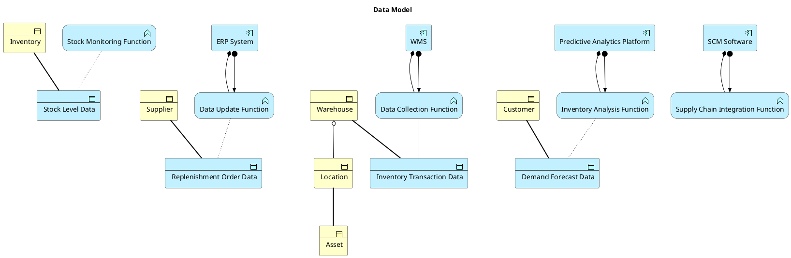
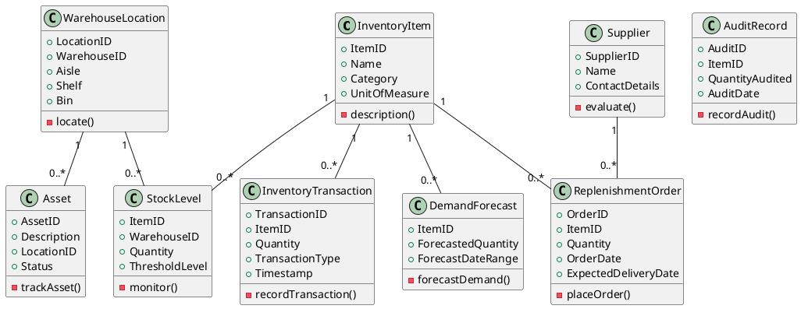
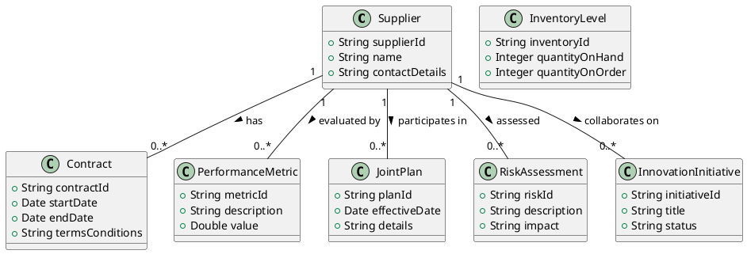

[[Information systems architecture]]

```plantuml
@startuml
component ERP_System
component CRM_System
component WMS
component TMS
component SCM_Software
component Predictive_Analytics_Platform
component Customer_Order_Management_System
component Customs_and_Compliance_Software
component Shipping_Application

database Market_Data_Analysis

database Customer_Demand_Prediction

database Inventory_Level_Monitoring

database Replenishment_Order_Generation

database Supplier_Order_Management

database Lead_Time_Tracking

database Stock_Receiving_and_Verification

database Scenario_Planning_and_Simulation

database Process_Customer_Orders

database Dynamic_Routing_and_Rerouting

database Customs_and_Compliance_Management

database Carrier_Performance_Tracking

database Planning_Transportation_Routes

database Coordinating_Logistics_Partners

database Handling_Warranty_Claims_and_Maintenance_Services

database Packaging_and_Shipping_Product

database Ordering_Materials

ERP_System -down-> Market_Data_Analysis : <<generates>>
ERP_System -down-> Customer_Demand_Prediction : <<uses>>
WMS -down-> Inventory_Level_Monitoring : <<updates>>
SCM_Software -down-> Replenishment_Order_Generation : <<triggers>>
SCM_Software -down-> Supplier_Order_Management : <<manages>>
SCM_Software -down-> Lead_Time_Tracking : <<tracks>>
WMS -down-> Stock_Receiving_and_Verification : <<verifies>>
Predictive_Analytics_Platform -down-> Scenario_Planning_and_Simulation : <<supports>>
Customer_Order_Management_System -down-> Process_Customer_Orders : <<processes>>
TMS -down-> Dynamic_Routing_and_Rerouting : <<optimizes>>
Customs_and_Compliance_Software -down-> Customs_and_Compliance_Management : <<ensures>>
TMS -down-> Carrier_Performance_Tracking : <<monitors>>
TMS -down-> Planning_Transportation_Routes : <<plans>>
SCM_Software -down-> Coordinating_Logistics_Partners : <<coordinates>>
CRM_System -down-> Handling_Warranty_Claims_and_Maintenance_Services : <<handles>>
Shipping_Application -down-> Packaging_and_Shipping_Product : <<ships>>
ERP_System -down-> Ordering_Materials : <<orders>>
@enduml
```



![[Pasted image 20240328112004.png]]
## Realtime inventory tracking




## Demand forecast

```plantuml
@startuml
!include <archimate/archimate.puml>

' Define Business Objects
Business_Object(salesData, "Sales Data")
Business_Object(marketTrends, "Market Trends")
Business_Object(customerInfo, "Customer Info")
Business_Object(inventoryLevels, "Inventory Levels")

' Define Data Objects
Application_DataObject(salesDataObject, "Sales Data Object")
Application_DataObject(marketTrendsObject, "Market Trends Object")
Application_DataObject(customerInfoObject, "Customer Info Object")
Application_DataObject(inventoryLevelsObject, "Inventory Levels Object")

' Define Application Components
Application_Component(erp, "ERP System")
Application_Component(crm, "CRM System")
Application_Component(wms, "WMS")
Application_Component(analytics, "Predictive Analytics Platform")

' Define Application Functions
Application_Function(demandForecasting, "Demand Forecasting Function")
Application_Function(inventoryManagement, "Inventory Management Function")
Application_Function(orderProcessing, "Order Processing Function")
Application_Function(dataAnalysis, "Data Analysis Function")

' Relationships
Rel_Composition(erp, salesDataObject)
Rel_Composition(crm, customerInfoObject)
Rel_Composition(wms, inventoryLevelsObject)
Rel_Composition(analytics, marketTrendsObject)

Rel_Aggregation(salesData, salesDataObject)
Rel_Aggregation(marketTrends, marketTrendsObject)
Rel_Aggregation(customerInfo, customerInfoObject)
Rel_Aggregation(inventoryLevels, inventoryLevelsObject)


' Connect Application Functions to Components
Rel_Assignment(erp, demandForecasting)
Rel_Assignment(erp, inventoryManagement)
Rel_Assignment(erp, orderProcessing)
Rel_Assignment(analytics, dataAnalysis)

' Connect Data Objects to Application Functions
Rel_Access(demandForecasting, salesDataObject)
Rel_Access(inventoryManagement, inventoryLevelsObject)
Rel_Access(orderProcessing, customerInfoObject)
Rel_Access(dataAnalysis, marketTrendsObject)

@enduml
```




Conceptual data model

In this conceptual data model:

- **InventoryItem**: Represents each unique item that can be held in inventory.
- **StockLevel**: Tracks the quantity of each InventoryItem at a specific WarehouseLocation.
- **InventoryTransaction**: Records movements and changes in inventory, such as sales, returns, or transfers.
- **WarehouseLocation**: Identifies specific locations within a warehouse where inventory is stored.
- **Supplier**: Contains information about the companies that supply InventoryItems.
- **ReplenishmentOrder**: Represents orders placed with suppliers to replenish inventory.
- **Asset**: Tracks assets used in the inventory and supply chain process.
- **DemandForecast**: Predictions about future demand for InventoryItems.
- **AuditRecord**: Documentation of inventory audits for compliance and verification purposes.

The relationships between these entities are essential to understanding how data flows within the Real-time Inventory Tracking system. This high-level conceptual model can be refined further as we progress to the logical and physical stages of data modeling, where more detailed attributes and relationships will be specified.



## Supplier collaboration and integration

![[Pasted image 20240328111810.png]]
**Business Objects:**

- Supplier Profile: Contains supplier information such as contacts, capabilities, and performance history.
- Contract: Legal agreements outlining the terms of the supplier relationship.
- Performance Review: Documentation of supplier evaluations based on KPIs and metrics.

**Aggregations:**

- Supplier Information System: An aggregation of supplier profiles, contracts, and performance reviews.

**Compositions:**

- Supplier Database: A composition of data objects that include supplier profiles, contract details, and performance data.

**Data Objects:**

- Supplier Data: Information about suppliers, including qualifications and certifications.
- Contract Data: Specific terms, conditions, and clauses of supplier contracts.
- Performance Data: Metrics and KPIs related to supplier evaluations.

**Application Components:**

- Supplier Relationship Management (SRM) System: Software that manages interactions with suppliers.
- Contract Lifecycle Management (CLM) System: Application for managing the creation, execution, and analysis of contracts.
- Performance Management Tool: Application for tracking and analyzing supplier performance.

**Application Functions:**

- Supplier Onboarding Function: The process within the SRM system for adding new suppliers.
- Contract Negotiation Function: A function of the CLM system for managing contract negotiations.
- Performance Analysis Function: A feature of the performance management tool for evaluating supplier metrics.

```plantuml
@startuml
!include <archimate/archimate.puml>

' Define Business Objects
business_object SupplierProfile "Supplier Profile"
business_object Contract "Contract"
business_object PerformanceReview "Performance Review"

' Define Aggregations
business_object SupplierInformationSystem "Supplier Information System" {
  SupplierProfile
  Contract
  PerformanceReview
}

' Define Compositions
data_object SupplierDatabase "Supplier Database" {
  SupplierData
  ContractData
  PerformanceData
}

' Define Data Objects
data_object SupplierData "Supplier Data"
data_object ContractData "Contract Data"
data_object PerformanceData "Performance Data"

' Define Application Components
application_component SRMSystem "SRM System"
application_component CLMSystem "CLM System"
application_component PerformanceManagementTool "Performance Management Tool"

' Define Application Functions
application_function SupplierOnboardingFunction "Supplier Onboarding Function"
application_function ContractNegotiationFunction "Contract Negotiation Function"
application_function PerformanceAnalysisFunction "Performance Analysis Function"

' Define Relationships
SupplierProfile -[hidden]-> SupplierInformationSystem : part of
Contract -[hidden]-> SupplierInformationSystem : part of
PerformanceReview -[hidden]-> SupplierInformationSystem : part of

SupplierData
```


In this conceptual data model:



- The `Supplier` entity represents the suppliers that Farm Corporation collaborates with. It includes basic identification and contact information.
- The `Contract` entity encapsulates the details of legal agreements between Farm Corporation and its suppliers.
- `PerformanceMetric` captures the performance-related data points used to evaluate supplier performance.
- `InventoryLevel` reflects the current status of inventory related to specific suppliers or materials.
- `JointPlan` represents the collaborative planning documents that outline production forecasts and other joint activities.
- `RiskAssessment` contains the analysis of potential risks associated with each supplier.
- `InnovationInitiative` records the details of joint innovation projects and continuous improvement efforts with suppliers.

The relationships indicate that each supplier can have multiple contracts, performance metrics, joint plans, risk assessments, and innovation initiatives associated with them.

This high-level conceptual data model serves as a starting point for understanding the structure of information used in supplier collaboration and integration. As the project progresses, the model can be refined and expanded into a more detailed logical data model, and eventually into a physical data model that specifies how the data will be stored in databases.