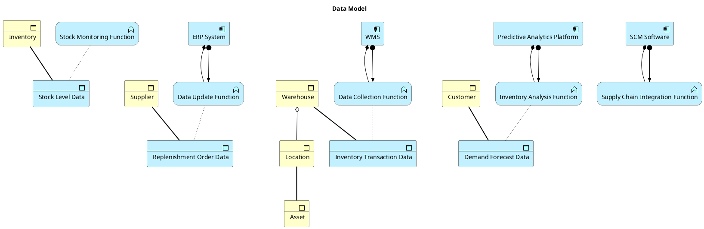

[[Information systems architecture]]

```plantuml
@startuml
!include <archimate/Archimate>

title Data Model
' Define Business Objects
Business_Object(inventory, "Inventory")
Business_Object(supplier, "Supplier")
Business_Object(warehouse, "Warehouse")
Business_Object(location, "Location")
Business_Object(asset, "Asset")
Business_Object(customer, "Customer")

' Define Data Objects
Application_DataObject(stockLevel, "Stock Level Data")
Application_DataObject(inventoryTransaction, "Inventory Transaction Data")
Application_DataObject(demandForecast, "Demand Forecast Data")
Application_DataObject(replenishmentOrder, "Replenishment Order Data")

' Define Application Components
Application_Component(erp, "ERP System")
Application_Component(wms, "WMS")
Application_Component(scm, "SCM Software")
Application_Component(analytics, "Predictive Analytics Platform")

' Define Application Functions
Application_Function(dataCollection, "Data Collection Function")
Application_Function(dataUpdate, "Data Update Function")
Application_Function(stockMonitoring, "Stock Monitoring Function")
Application_Function(inventoryAnalysis, "Inventory Analysis Function")
Application_Function(supplyChainIntegration, "Supply Chain Integration Function")

' Rel_Aggregations and Rel_Compositions
Rel_Aggregation(warehouse, location)
Rel_Composition(erp, dataUpdate)
Rel_Composition(wms, dataCollection)
Rel_Composition(scm, supplyChainIntegration)
Rel_Composition(analytics, inventoryAnalysis)

' Relationships between Business and Data Objects
Rel_Association(inventory, stockLevel)
Rel_Association(supplier, replenishmentOrder)
Rel_Association(warehouse, inventoryTransaction)
Rel_Association(location, asset)
Rel_Association(customer, demandForecast)

' Relationships between Application Functions and Data Objects
Rel_Access(dataCollection, inventoryTransaction)
Rel_Access(stockMonitoring, stockLevel)
Rel_Access(inventoryAnalysis, demandForecast)
Rel_Access(dataUpdate, replenishmentOrder)

' Relationships between Application Components and Functions
Rel_Assignment(erp, dataUpdate)
Rel_Assignment(wms, dataCollection)
Rel_Assignment(scm, supplyChainIntegration)
Rel_Assignment(analytics, inventoryAnalysis)

' Layout
'layout_left_right
@enduml 

```

## Demand forecast

```plantuml
@startuml
!include <archimate/archimate.puml>

' Define Business Objects
Business_Object(salesData, "Sales Data")
Business_Object(marketTrends, "Market Trends")
Business_Object(customerInfo, "Customer Info")
Business_Object(inventoryLevels, "Inventory Levels")

' Define Data Objects
Application_DataObject(salesDataObject, "Sales Data Object")
Application_DataObject(marketTrendsObject, "Market Trends Object")
Application_DataObject(customerInfoObject, "Customer Info Object")
Application_DataObject(inventoryLevelsObject, "Inventory Levels Object")

' Define Application Components
Application_Component(erp, "ERP System")
Application_Component(crm, "CRM System")
Application_Component(wms, "WMS")
Application_Component(analytics, "Predictive Analytics Platform")

' Define Application Functions
Application_Function(demandForecasting, "Demand Forecasting Function")
Application_Function(inventoryManagement, "Inventory Management Function")
Application_Function(orderProcessing, "Order Processing Function")
Application_Function(dataAnalysis, "Data Analysis Function")

' Relationships
Rel_Composition(erp, salesDataObject)
Rel_Composition(crm, customerInfoObject)
Rel_Composition(wms, inventoryLevelsObject)
Rel_Composition(analytics, marketTrendsObject)

Rel_Aggregation(salesData, salesDataObject)
Rel_Aggregation(marketTrends, marketTrendsObject)
Rel_Aggregation(customerInfo, customerInfoObject)
Rel_Aggregation(inventoryLevels, inventoryLevelsObject)


' Connect Application Functions to Components
Rel_Assignment(erp, demandForecasting)
Rel_Assignment(erp, inventoryManagement)
Rel_Assignment(erp, orderProcessing)
Rel_Assignment(analytics, dataAnalysis)

' Connect Data Objects to Application Functions
Rel_Access(demandForecasting, salesDataObject)
Rel_Access(inventoryManagement, inventoryLevelsObject)
Rel_Access(orderProcessing, customerInfoObject)
Rel_Access(dataAnalysis, marketTrendsObject)

@enduml
```