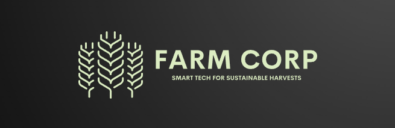
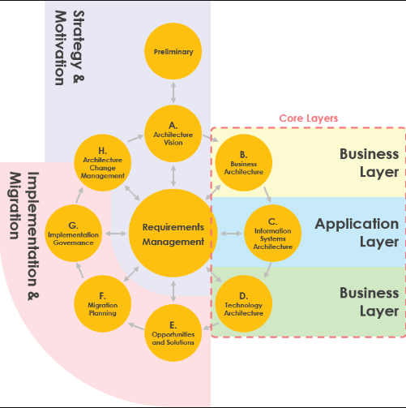
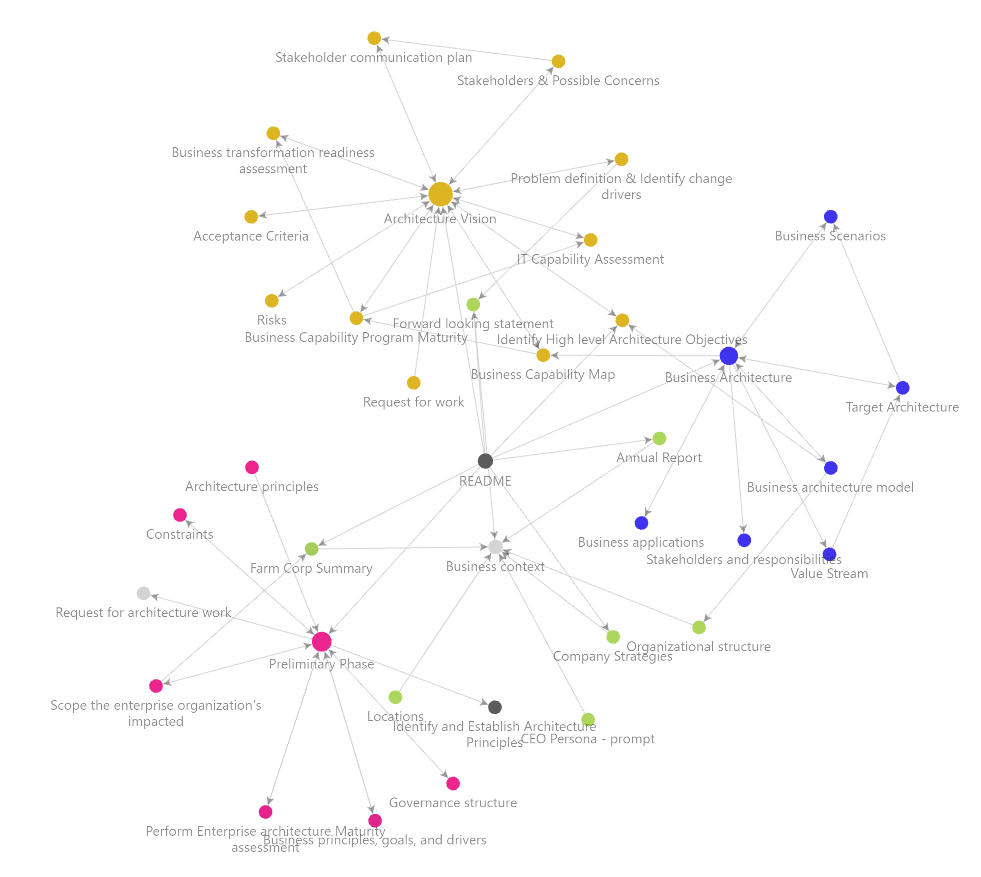
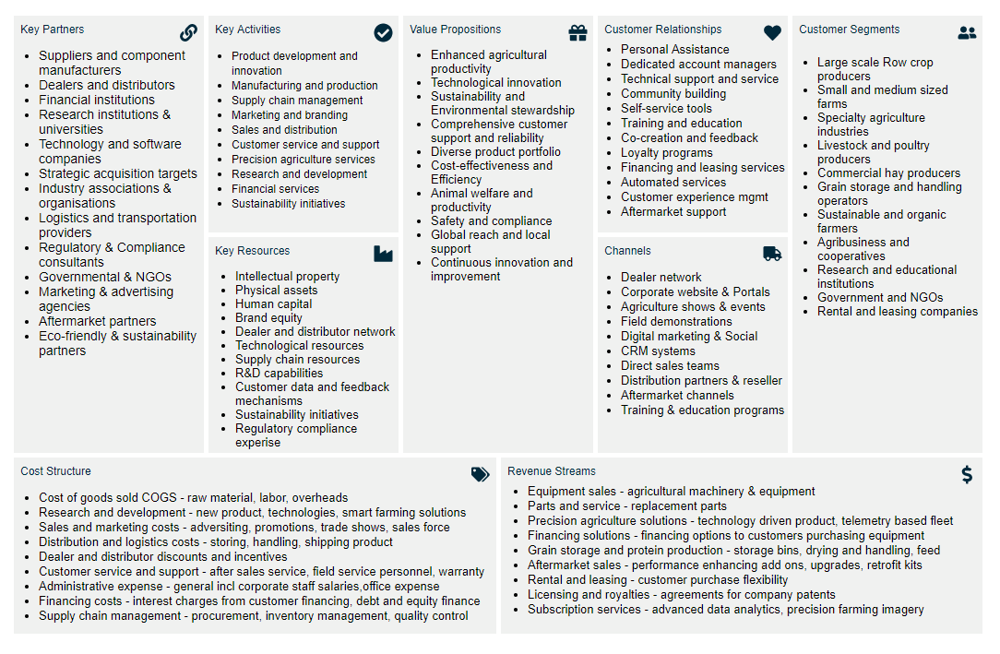
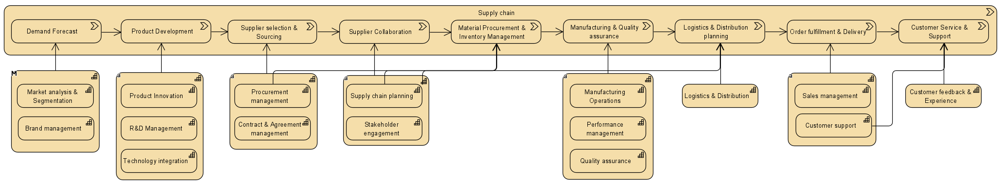
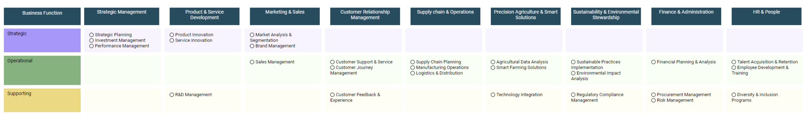
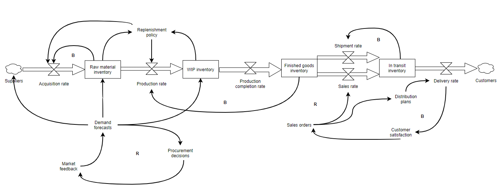
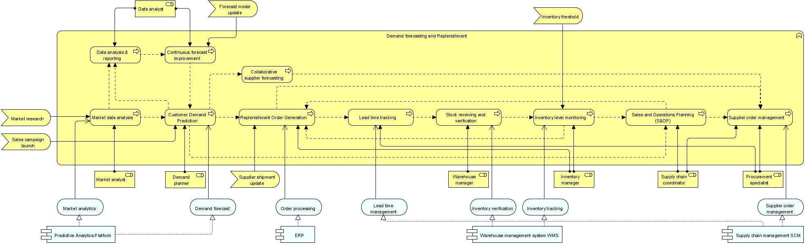

**Program Background**
Farm Corp operates in an increasingly volatile global agricultural landscape, characterized by rapid technological changes, supply chain complexities, and economic fluctuations. The resilience of its supply chain is paramount to maintain uninterrupted operations, meet customer demands, and uphold our competitive edge. This enterprise architecture program is poised to address these challenges through a comprehensive digital transformation strategy. This initiative is aligned with the strategic business objectives to enhance supply chain visibility, leverage predictive analytics, and ensure system integration and interoperability, all while maintaining data security and compliance.
# Farm Corp Enterprise Architecture
___
Farm Corporation Architecture implementation based on the TOGAF ADM methodology.

## Getting started

The project is based off an Obsidian vault in order to manage and structure the architecture repository.
1. Download and install Obsidian https://obsidian.md/download
	1. To the right of **Open folder as vault**, click **Open**.
	2. In the file browser, select the folder you want to use as your vault.
	3. Click **Open**.
	4. Suggested Obsidian plugins: Dataview, PlantUML, Image toolkit

2. _Optional:_ Download Visual Paradigm https://www.visual-paradigm.com/
	1. Select **View > Project Browser** from the toolbar
	2. Click on the **Open Project Browser** on the right-hand side of the navigation bar of any diagram
	3. Select the Farm Corp project
	
3. Business context
	1. View business background and context incl annual reports, forward looking statements from the board of directors, company strategies etc.

> **Note:** Obsidian is required to view diagrams within markdown documents. Image links won't resolve using Github .md viewer.

### Business Background and Context

[[Farm Corp Summary]] | [[Company Strategies]] | [[Forward looking statement]] | [[Annual Report]]

**Digital Transformation for Supply Chain Resilience**

Farm Corp operates in a dynamic global agricultural market that is increasingly reliant on digital technologies to optimize operations. The business context involves a complex supply chain network that is subject to various risks, including logistical disruptions, supplier bottlenecks, and global events affecting material availability. The enterprise architecture is pivotal in transforming this network into a digitally empowered, resilient system capable of adapting to changes and maintaining operational continuity.

The integration of digital transformation and data utilization into the supply chain directly addresses the vulnerability by providing real-time visibility, predictive analytics, and adaptive response mechanisms. This transformation requires an overhaul of the existing supply chain architecture to incorporate advanced technologies such as IoT, AI, and cloud computing, which facilitate better decision-making and agility.

### Key objectives

[[Identify High level Architecture Objectives]]

**Enhanced Supply Chain Visibility** - To achieve complete transparency across the entire supply chain, enabling real-time tracking and monitoring of all processes, from sourcing to delivery.
- [[Target Architecture#1. Real-time Inventory Tracking]]
**Predictive Supply Chain Analytics** - To utilize predictive analytics for demand forecasting, risk assessment, and proactive supply chain planning to minimize the impact of disruptions.
- [[Target Architecture#2. Demand Forecasting and Replenishment]]
**Supply Chain Flexibility and Responsiveness** - To enable a flexible and responsive supply chain capable of adapting to changes in market demand, supplier issues, or logistical challenges quickly.

**Supplier Collaboration and Integration** - To foster closer collaboration with suppliers through improved information sharing and joint planning capabilities.
- [[Target Architecture#3. Supplier Collaboration and Integration]]
**Reduction of Operational Costs** - To reduce operational costs associated with inventory management, logistics, and procurement processes.

## Methodology

The TOGAF Architecture Development Method (ADM) offers a structured approach for organizations to develop, manage, and evolve their enterprise architecture. It consists of the following phases:

1. **[[Preliminary Phase]]**: Establishes the organizational context for enterprise architecture and defines the tailored architecture framework and principles.
    
2. **Phase A - [[Architecture Vision]]**: Involves the development of a high-level vision of the architecture that supports the business strategy.
    
3. **Phase B - [[Business Architecture]]**: Defines the business strategy, governance, organization, and key business processes of the organization.
    
4. **Phase C - [[Information systems architecture]]**:
    - **Data Architecture**: Details the structure of an organization's logical and physical data assets and data management resources.
    - **Application Architecture**: Provides a blueprint for the individual application systems to be deployed, their interactions, and their relationships to the core business processes.
5. **Phase D - Technology Architecture**: Describes the logical software and hardware capabilities required to support the deployment of business, data, and application services.
    
6. **Phase E - Opportunities and Solutions**: Identifies delivery vehicles for the architecture defined in the previous phases.
    
7. **Phase F - Migration Planning**: Addresses planning for the implementation of the architecture projects identified in Phase E.
    
8. **Phase G - Implementation Governance**: Provides an architectural oversight of the implementation.
    
9. **Phase H - Architecture Change Management**: Establishes procedures for managing changes to the new architecture.
    
10. **Requirements Management**: A central process that ensures that the Architecture Development Method responds to the dynamic nature of business drivers and changes in requirements.

## Highlights

**Business model**

**Value stream**

**Capability mapping**

**Stock and Flow**

**Target architecture**

