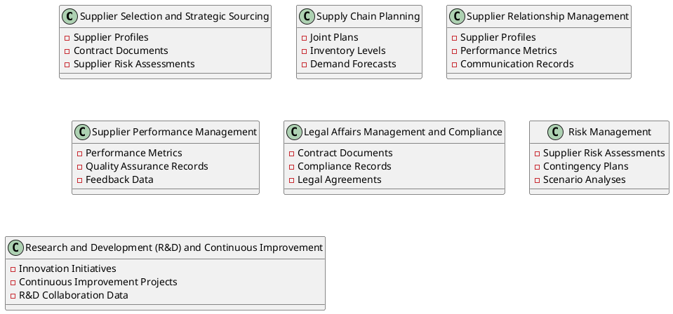

[[Information systems architecture]]

The purpose of the Data Entity/Business Function matrix is to depict the relationship between data entities and business functions within the enterprise. 
- The mapping of the Data Entity-Business Function relationship enables the following to take place: 
	- Assignment of ownership of data entities to organizations 
	- Understand the data and information exchange requirements business services 
	- Support the gap analysis and determine whether any data entities are missing and need to be created 
	- Define system of origin, system of record, and system of reference for data entities 
	- Enable development of data governance programs across the enterprise (establish data steward, develop data standards pertinent to the business function, etc.)

### Master data

1. **Item Master Data**
    
    - Contains information about each inventory item, such as item ID, description, unit of measure, and category. It may also include details about the item's dimensions, weight, and handling requirements.
2. **Supplier Master Data**
    
    - Records details about suppliers, including supplier ID, company name, contact information, performance metrics, and terms of service. It's used for managing procurement and evaluating supplier performance.
3. **Warehouse Master Data**
    
    - Includes information on each warehouse facility, such as warehouse ID, location, storage capacity, layout, and handling equipment. It's essential for managing warehouse operations and optimizing storage.
4. **Location Master Data**
    
    - Details the specific storage locations within each warehouse, like aisle, shelf, bin, or pallet positions. It ensures precise tracking and retrieval of inventory items.
5. **Customer Master Data**
    
    - Captures customer information, such as customer ID, name, shipping addresses, billing details, and contact information. It's crucial for processing orders and managing customer relationships.
6. **Asset Master Data**
    
    - Contains details about assets used in the supply chain, including asset ID, type, status, and location. It's used for tracking assets as they move through the supply chain.
7. **Inventory Status Master Data**
    
    - Enumerates possible statuses of inventory items, such as 'available', 'reserved', 'in transit', or 'damaged'. It's used in conjunction with real-time tracking to accurately reflect the condition and availability of inventory.
8. **Unit of Measure Master Data**
    
    - Defines the units of measure used for inventory items, ensuring consistency in how quantities are recorded, reported, and analyzed across the enterprise.
9. **Product Catalog Master Data**
    
    - A comprehensive listing of all products available for sale, including product specifications, pricing, and categorization. It supports sales processes and eCommerce activities.

## Real-time inventory tracking

Here are the business functions related to Real-time Inventory Tracking and the data entities involved:

1. **Inventory Data Collection**
    
    - Data Entities: Inventory Item, Warehouse Location
2. **Inventory Database Updates**
    
    - Data Entities: Inventory Item, Stock Level, Inventory Transaction
3. **Stock Level Monitoring**
    
    - Data Entities: Stock Level, Inventory Item, Warehouse Location
4. **Inventory Analysis and Reporting**
    
    - Data Entities: Inventory Item, Stock Level, Inventory Transaction, Demand Forecast
5. **Integration with Supply Chain Management**
    
    - Data Entities: Inventory Item, Stock Level, Supplier Information, Replenishment Order
6. **Demand-Supply Reconciliation**
    
    - Data Entities: Stock Level, Demand Forecast, Inventory Item
7. **Replenishment Automation**
    
    - Data Entities: Stock Level, Replenishment Order, Inventory Item
8. **Asset Tracking and Management**
    
    - Data Entities: Asset Information, Warehouse Location
9. **Inventory Visibility for Stakeholders**
    
    - Data Entities: Inventory Item, Stock Level, Warehouse Location
10. **Audit and Compliance**
    
    - Data Entities: Inventory Transaction, Audit Record

## Demand forecasting

To construct the Data Entity/Business Function matrix for demand forecasting at Farm Corporation, we will identify the relevant business functions and map them to the data entities they interact with. This matrix will help in assigning ownership, understanding data exchange requirements, supporting gap analysis, defining systems of origin/record/reference, and enabling data governance programs.

|Business Function|Data Entity|Ownership|System of Origin|System of Record|
|---|---|---|---|---|
|Market Data Analysis|Market Trends|Market Research Team|Market Research Databases|Business Intelligence|
|Market Data Analysis|Economic Indicators|Market Research Team|Market Research Databases|Business Intelligence|
|Market Data Analysis|Competitor Analysis|Market Research Team|Market Research Databases|Business Intelligence|
|Customer Demand Prediction|Customer Demographics|Sales Planning Team|CRM System|Sales Data Warehouse|
|Customer Demand Prediction|Sales History|Sales Planning Team|CRM System|Sales Data Warehouse|
|Customer Demand Prediction|Promotional Campaigns|Sales Planning Team|Marketing Management System|Sales Data Warehouse|
|Inventory Level Monitoring|Inventory Levels|Inventory Management Team|WMS|ERP System|
|Inventory Level Monitoring|Product Catalog|Inventory Management Team|Product Information System|ERP System|
|Sales and Operations Planning (S&OP)|Sales Forecasts|Operations Team|S&OP Planning Tools|ERP System|
|Sales and Operations Planning (S&OP)|Production Schedules|Operations Team|S&OP Planning Tools|ERP System|
|Sales and Operations Planning (S&OP)|Supply Chain Constraints|Operations Team|SCM Software|ERP System|
|Replenishment Order Generation|Replenishment Orders|Procurement Team|SCM Software|ERP System|
|Replenishment Order Generation|Supplier Lead Times|Procurement Team|SCM Software|ERP System|
|Replenishment Order Generation|Inventory Reorder Points|Procurement Team|SCM Software|ERP System|
|Supplier Order Management|Supplier Orders|Supply Chain Team|SCM Software|ERP System|
|Supplier Order Management|Supplier Performance Metrics|Supply Chain Team|SCM Software|ERP System|
|Lead Time Tracking|Lead Time Data|Logistics Team|SCM Software|ERP System|
|Lead Time Tracking|Supplier Delivery Performance|Logistics Team|SCM Software|ERP System|
|Stock Receiving and Verification|Received Goods Data|Warehouse Management Team|WMS|ERP System|
|Stock Receiving and Verification|Quality Inspection Reports|Warehouse Management Team|WMS|ERP System|
|Stock Receiving and Verification|Stock Update Transactions|Warehouse Management Team|WMS|ERP System|
|Scenario Planning and Simulation|Scenario Models|Strategic Planning Team|Predictive Analytics Platform|Business Intelligence|
|Scenario Planning and Simulation|Risk Assessment Data|Strategic Planning Team|Predictive Analytics Platform|Business Intelligence|
|Scenario Planning and Simulation|Simulated Outcomes|Strategic Planning Team|Predictive Analytics Platform|Business Intelligence|
|Continuous Forecasting Improvement|Forecast Accuracy Reports|Data Science Team|Predictive Analytics Platform|Data Analysis Tools|
|Continuous Forecasting Improvement|Historical Forecast Data|Data Science Team|Predictive Analytics Platform|Data Analysis Tools|
|Continuous Forecasting Improvement|Forecasting Model Parameters|Data Science Team|Predictive Analytics Platform|Data Analysis Tools|
|Process Customer Orders|Customer Orders|Customer Service Team|Customer Order Management System|CRM System|
|Process Customer Orders|Order Status|Customer Service Team|Customer Order Management System|CRM System|
|Process Customer Orders|Customer Feedback|Customer Service Team|Customer Order Management System|CRM System|

This matrix serves as a guide for Farm Corporation to manage its data entities in relation to demand forecasting, ensuring that the right teams have ownership and that data is accurately

**Business Functions and Data Entities Matrix:**

1. **Market Data Analysis**
    
    - Data Entities: Market Trends, Economic Indicators, Competitor Analysis
    - Ownership: Market Research Team
    - System of Origin: Market Research Databases
    - System of Record: Business Intelligence System
2. **Customer Demand Prediction**
    
    - Data Entities: Customer Demographics, Sales History, Promotional Campaigns
    - Ownership: Sales Planning Team
    - System of Origin: CRM System
    - System of Record: Sales Data Warehouse
3. **Inventory Level Monitoring**
    
    - Data Entities: Inventory Levels, Product Catalog, Warehouse Stock
    - Ownership: Inventory Management Team
    - System of Origin: WMS
    - System of Record: ERP System
4. **Sales and Operations Planning (S&OP)**
    
    - Data Entities: Sales Forecasts, Production Schedules, Supply Chain Constraints
    - Ownership: Operations Team
    - System of Origin: S&OP Planning Tools
    - System of Record: ERP System
5. **Replenishment Order Generation**
    
    - Data Entities: Replenishment Orders, Supplier Lead Times, Inventory Reorder Points
    - Ownership: Procurement Team
    - System of Origin: SCM Software
    - System of Record: ERP System
6. **Supplier Order Management**
    
    - Data Entities: Supplier Orders, Supplier Performance Metrics, Delivery Schedules
    - Ownership: Supply Chain Team
    - System of Origin: SCM Software
    - System of Record: ERP System
7. **Lead Time Tracking**
    
    - Data Entities: Lead Time Data, Supplier Delivery Performance
    - Ownership: Logistics Team
    - System of Origin: SCM Software
    - System of

## Supplier collaboration

To establish a Data Entity/Business Function matrix for the supplier collaboration and integration within Farm Corporation, we must map the relationship between specific data entities and the business functions they support. Here's how the matrix would look:

|Business Function|Data Entities|
|---|---|
|Supplier Selection and Strategic Sourcing|Supplier Profiles|
||Contract Documents|
||Supplier Risk Assessments|
|Supply Chain Planning|Joint Plans|
||Inventory Levels|
||Demand Forecasts|
|Supplier Relationship Management|Supplier Profiles|
||Performance Metrics|
||Communication Records|
|Supplier Performance Management|Performance Metrics|
||Quality Assurance Records|
||Feedback Data|
|Legal Affairs Management and Compliance|Contract Documents|
||Compliance Records|
||Legal Agreements|
|Risk Management|Supplier Risk Assessments|
||Contingency Plans|
||Scenario Analyses|
|Research and Development (R&D) and Continuous Improvement|Innovation Initiatives|
||Continuous Improvement Projects|
||R&D Collaboration Data|

**Business Functions and Related Data Entities:**

1. **Supplier Selection and Strategic Sourcing**
    
    - Data Entities: Supplier Profiles, Contract Documents, Supplier Risk Assessments
    - Purpose: To evaluate, select, and onboard suppliers; manage contracts; assess supplier-related risks.
2. **Supply Chain Planning**
    
    - Data Entities: Joint Plans, Inventory Levels, Demand Forecasts
    - Purpose: To align Farm Corporation's production and inventory with suppliers' capabilities and market demand forecasts.
3. **Supplier Relationship Management**
    
    - Data Entities: Supplier Profiles, Performance Metrics, Communication Records
    - Purpose: To maintain and enhance relationships with suppliers through effective communication and performance monitoring.
4. **Supplier Performance Management**
    
    - Data Entities: Performance Metrics, Quality Assurance Records, Feedback Data
    - Purpose: To track, analyze, and manage supplier performance to ensure compliance with Farm Corporation's quality standards.
5. **Legal Affairs Management and Compliance**
    
    - Data Entities: Contract Documents, Compliance Records, Legal Agreements
    - Purpose: To ensure all supplier contracts are legally sound, compliant with regulations, and adhered to by both parties.
6. **Risk Management**
    
    - Data Entities: Supplier Risk Assessments, Contingency Plans, Scenario Analyses
    - Purpose: To identify, assess, and mitigate risks associated with suppliers and develop contingency plans to ensure supply chain resilience.
7. **Research and Development (R&D) and Continuous Improvement**
    
    - Data Entities: Innovation Initiatives, Continuous Improvement Projects, R&D Collaboration Data
    - Purpose: To collaborate with suppliers on innovation projects, R&D efforts, and continuous improvement initiatives.

By mapping these relationships, Farm Corporation can achieve several key outcomes:

- Assign ownership of data entities to the appropriate business functions.
- Understand the data and information exchange requirements between business services.
- Support gap analysis to identify missing data entities.
- Define the system of origin, system of record, and system of reference for each data entity.
- Enable the development of data governance programs, including the appointment of data stewards and the establishment of data standards relevant to each business function.

This matrix is a foundational tool for ensuring that Farm Corporation's data assets are managed effectively and that supplier collaboration and integration efforts are data-driven and aligned with the company's strategic goals.